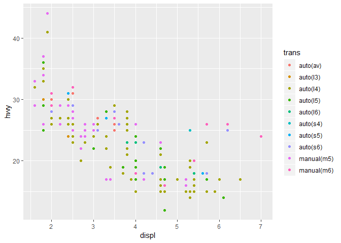
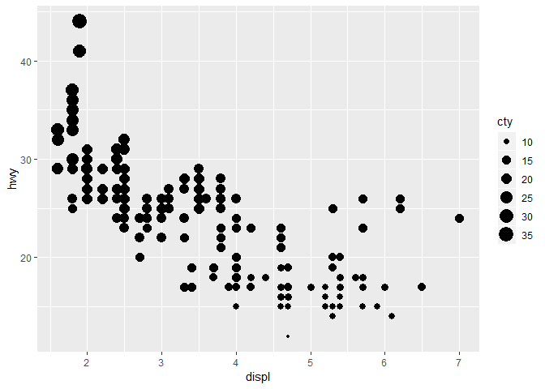
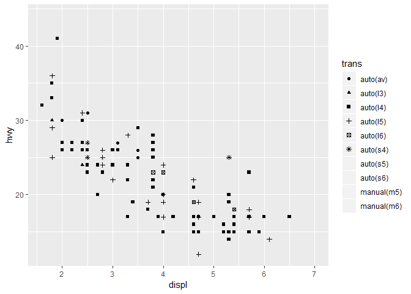
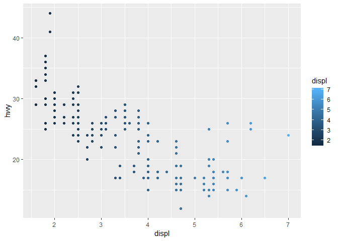
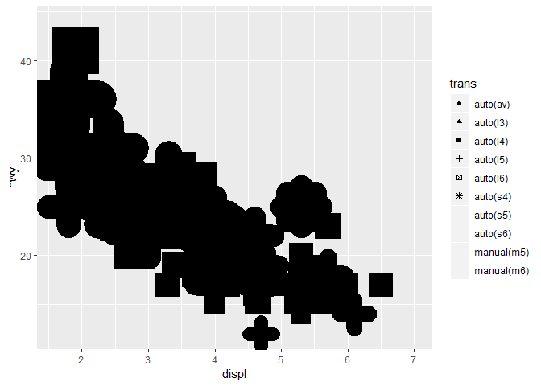

Homework 1: ggplot2
================
Valter Aro
2019-03-08

``` r
library(ggplot2)
mpg
```

    ## # A tibble: 234 x 11
    ##    manufacturer model displ  year   cyl trans drv     cty   hwy fl    class
    ##    <chr>        <chr> <dbl> <int> <int> <chr> <chr> <int> <int> <chr> <chr>
    ##  1 audi         a4      1.8  1999     4 auto~ f        18    29 p     comp~
    ##  2 audi         a4      1.8  1999     4 manu~ f        21    29 p     comp~
    ##  3 audi         a4      2    2008     4 manu~ f        20    31 p     comp~
    ##  4 audi         a4      2    2008     4 auto~ f        21    30 p     comp~
    ##  5 audi         a4      2.8  1999     6 auto~ f        16    26 p     comp~
    ##  6 audi         a4      2.8  1999     6 manu~ f        18    26 p     comp~
    ##  7 audi         a4      3.1  2008     6 auto~ f        18    27 p     comp~
    ##  8 audi         a4 q~   1.8  1999     4 manu~ 4        18    26 p     comp~
    ##  9 audi         a4 q~   1.8  1999     4 auto~ 4        16    25 p     comp~
    ## 10 audi         a4 q~   2    2008     4 manu~ 4        20    28 p     comp~
    ## # ... with 224 more rows

By using *mpg* dataset:

1.  Map a continuous variable to color, size, and shape. How do these aesthetics behave differently for categorical vs. continuous variables?

-   Color

``` r
ggplot(data = mpg) +
  geom_point(mapping = aes(x = displ, y = hwy, color = trans))
```



``` r
#Color can be used for both continous variables and catergorical ones. With continous variables the color will be in a gradient from one extreme to the other.
```

-   Size

``` r
ggplot(data = mpg) +
  geom_point(mapping = aes(x = displ, y = hwy, size = cty))
```



``` r
#Size is not suitable for categorical variables, but is decent for continous variables.
```

-   Shape

``` r
ggplot(data = mpg) +
  geom_point(mapping = aes(x = displ, y = hwy, shape = trans))
```

    ## Warning: The shape palette can deal with a maximum of 6 discrete values
    ## because more than 6 becomes difficult to discriminate; you have
    ## 10. Consider specifying shapes manually if you must have them.

    ## Warning: Removed 96 rows containing missing values (geom_point).



``` r
#Shape can not be used for continous variables
```

1.  What happens if you map the same variable to multiple aesthetics?

``` r
ggplot(data = mpg) +
  geom_point(mapping = aes(x = displ, y = hwy, color = displ))
```



``` r
#Multiple aesthetics can be used for the same variable, but in most cases it does provide a better way for understanding the information.
```

1.  What does the stroke aesthetic do? What shapes does it work with? (Hint: use ?geom\_point)

``` r
ggplot(data = mpg) +
  geom_point(mapping = aes(x = displ, y = hwy, stroke = cty, shape = trans))
```

    ## Warning: The shape palette can deal with a maximum of 6 discrete values
    ## because more than 6 becomes difficult to discriminate; you have
    ## 10. Consider specifying shapes manually if you must have them.

    ## Warning: Removed 96 rows containing missing values (geom_point).



``` r
#Stroke is the size of the marker in the plot. For continous values it will be the number. It can not be used for categorical variables.
#For shapes that have a border (like 21), you can colour the inside and for shapes that have a border (like 21), you can colour the inside and
# outside separately. Use the stroke aesthetic to modify the width of the border
#For shapes 20-24 stroke changes the width of the border.
```

1.  What happens if you map an aesthetic to something other than a variable name, like aes(colour = displ &lt; 5)?

``` r
ggplot(data = mpg) +
  geom_point(mapping = aes(x = displ, y = hwy, color = displ < 5))
```


``` r
#When you map an aesthetic to a logic test it gives a TRUE or FALSE value in a given format.
```
